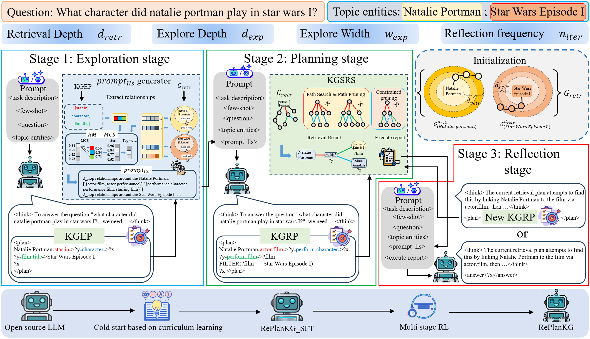
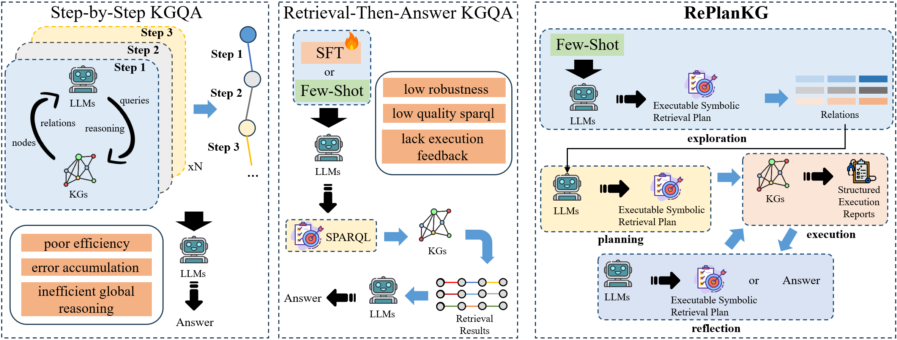
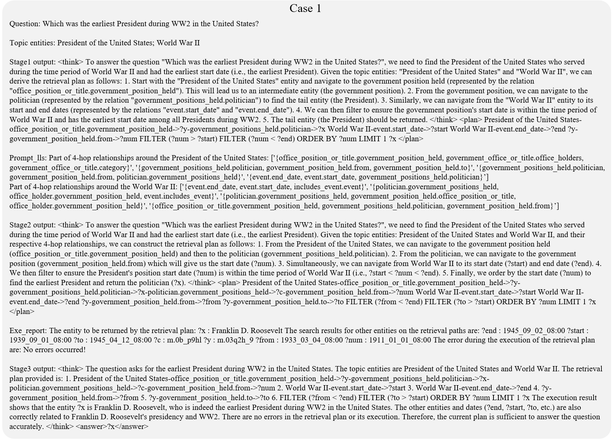

# RePlanKG：基于报告引导的符号规划知识图谱问答框架

[English Version](./README.md)

---

RePlanKG 是一个基于 **report-guided plan–execute–reflect（规划–执行–反思）闭环机制** 的知识图谱问答（KGQA）框架。  
该方法使大语言模型（LLMs）能够生成**可执行的符号检索计划**，在知识图谱上执行，并基于结构化执行反馈进行迭代修正，从而提升复杂多跳推理任务中的鲁棒性与效率。

本仓库提供 RePlanKG 的**官方推理代码实现**。

---

## 方法简介

知识图谱问答（KGQA）需要在大规模知识图谱上进行结构化多跳推理。然而现有方法存在明显不足：

### 一、Step-by-Step 类方法
- 多步生成不可控，推理效率较低  
- 误差逐步累积  
- 全局规划能力不足  

### 二、Retrieval-Then-Answer 类方法
- 鲁棒性较弱  
- 生成的符号查询质量不稳定（如 SPARQL）  
- 查询失败时缺乏执行反馈机制  

RePlanKG 通过引入 **report-guided 规划–执行–反思闭环机制**，实现：

- 显式符号规划  
- 结构化执行反馈  
- 可迭代的错误修正  
- 更高的推理鲁棒性与效率  

---

## 框架结构

### 1️⃣ RePlanKG 总体框架

<!-- 请替换为实际图片路径 -->


---

### 2️⃣ 与已有范式对比

<!-- 请替换为实际图片路径 -->


---

### 3️⃣ 案例分析示例

<!-- 请替换为实际图片路径 -->


---

## 环境安装

推荐使用 Python 3.10。

### 第一步：安装 PyTorch（CUDA 12.4 示例）

```
pip install torch==2.6.0 --index-url https://download.pytorch.org/whl/cu124
```

### 第二步：安装其他依赖

```
pip install -r requirements.txt
```

---

## 模型与数据下载说明

### 1️⃣ 下载 RePlanKG 模型参数

模型已上传至 ModelScope：

```
rebornyhy/replankg_13b
```

下载后，将模型文件夹放入：

```
./replankg_llm/
```

目录结构示例：

```
replankg_llm/
    config.json
    tokenizer.json
    pytorch_model.bin
    ...
```

---

### 2️⃣ 下载 mid2name.pkl 文件

百度网盘链接：  
https://pan.baidu.com/s/11mutP53dVkK-rWG8Olfgxg  
提取码：i2ga  

下载后：

将下载的 `mid2name` 文件夹替换项目中的：

```
./midname/
```

确保存在：

```
./mid2name/mid2name.pkl
```

---

### 3️⃣ 下载 data_kg 数据文件

百度网盘链接：  
https://pan.baidu.com/s/1uRbvdGbp7yD8PDaJgli6lA  
提取码：vi3f  

下载后，将下载的 `data_kg` 文件夹替换项目中的：

```
./data_kg/
```

---

## 推理运行

RePlanKG 提供统一推理脚本：

```
kgqa_infer_args.py
```

为方便用户使用，提供运行脚本：

```
run_replankg_infer.sh
```

### 使用步骤

1. 打开：

```
run_replankg_infer.sh
```

2. 在脚本顶部填写必要参数：

- LLM_PATH  
- MID2NAME_PATH  
- EMB_MODEL_PATH  
- DATA_PATH  
- EXP_NAME  
- OUTPUT_DIR  
- KG_CLASS（simpleques / webqsp / cwq）  

3. 运行：

```
bash run_replankg_infer.sh
```

脚本会自动拼接命令并执行推理。

---

## 项目结构

```
.
├── kgqa_infer_args.py        # 主推理脚本
├── run_replankg_infer.sh     # 推理运行脚本
├── replankg_llm/             # 模型权重（需下载）
├── data_kg/                  # KG 数据（需下载）
├── mid2name/                 # mid2name.pkl（需下载）
├── requirements.txt
└── ...
```

---

## 支持数据集

- SimpleQuestions  
- WebQSP  
- ComplexWebQuestions (CWQ)  

不同数据集所需 data_kg 文件不同，具体参数请参考 run_replankg_infer.sh。

---

## 复现说明

- 默认推理宽度 width = 3  
- 默认反思轮数 iter_n = 1  
- hop 数根据数据集自动设置：
  - simpleques → 1-hop  
  - webqsp → 2-hop  
  - cwq → 4-hop  

---

## 引用

如果本项目对您的研究有帮助，请引用：

```
@article{replankg2025,
  title={RePlanKG: Report-Guided Symbolic Planning for Knowledge Graph Question Answering},
  author={Anonymous},
  year={2025}
}
```

---

## 许可证

本项目采用 MIT License。

---

## 联系方式

如有问题或合作需求，请通过 Issue 联系。

